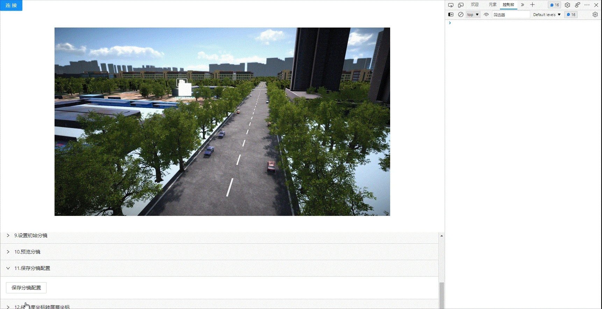

<!--
 * @Author: your name
 * @Date: 2022-3-30 14:32:54
 * @LastEditTime: 2022-04-15 10:39:06
 * @LastEditors: Please set LastEditors
 * @Description: 打开koroFileHeader查看配置 进行设置: https://github.com/OBKoro1/koro1FileHeader/wiki/%E9%85%8D%E7%BD%AE
 * @FilePath: /KD-API-DOCS/public/md/api/获取场景列表.md
-->
## 基础功能
### 摄像机

#### API名称：
保存分镜配置
#### 功能描述：

保存底座场景中分镜配置信息

#### 渲染示例：

#### 调用方法：

##### ES6 Modules
``` javascript
import { CameraConfig } from 'kd-api/lib'

CameraConfig.saveMirrorConfig()
.then((res)=>{
    // ⽣命体列表
    console.log(res)
})
.catch((err)=>{})
```

##### Script 标签
``` javascript
window.KdApi.CameraConfig.saveMirrorConfig()
.then((res)=>{
    // ⽣命体列表
    console.log(res)
})
.catch((err)=>{})
```


##### 回调参数描述：
| 属性    | 类型   | 说明                     |
| ------- | ------ | ------------------------ |
| code | Number | 200: 成功，500：失败        |
| message | String | 成功或失败描述        |
