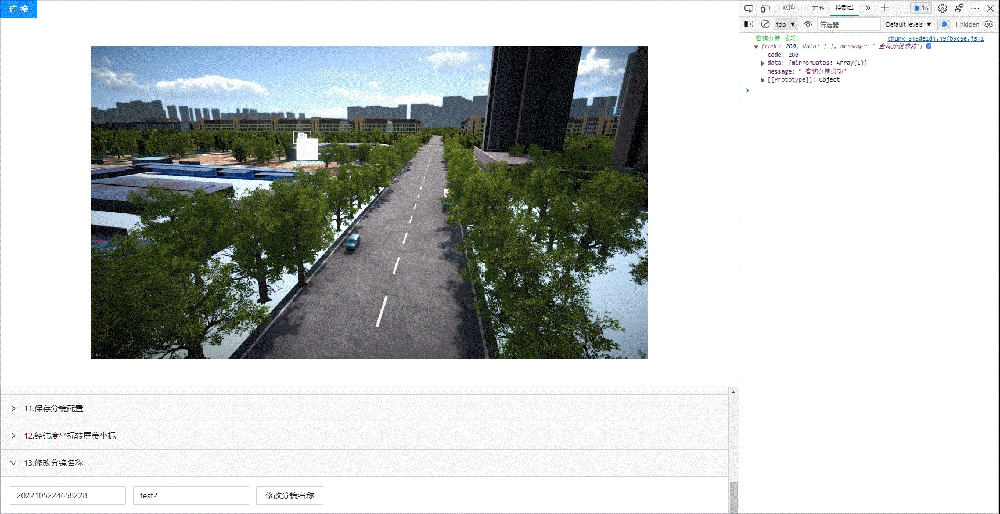

<!--
 * @Author: your name
 * @Date: 2022-03-30 15:08:15
 * @LastEditTime: 2022-04-14 11:11:17
 * @LastEditors: Please set LastEditors
 * @Description: 修改分镜名称
 * @FilePath: \KD-API-DOCS\public\md\api\修改分镜名称.md
-->
## 基础功能
### 摄像机

#### API名称：
修改分镜名称
#### 功能描述：

修改分镜列表中指定分镜的名称

#### 渲染示例：

#### 调用方法：

##### ES6 Modules
``` javascript
import { CameraConfig } from 'kd-api/lib'

CameraConfig.modifyName(jsondata)
.then((res)=>{
    // 修改别名成功
    console.log(res)
})
.catch((err)=>{})
```

##### Script 标签
``` javascript
window.KdApi.CameraConfig.modifyName(jsondata)
.then((res)=>{
    // 修改别名成功
    console.log(res)
})
.catch((err)=>{})
```

#### 数据格式：

```javascript
let jsondata = [{
    uuid: 'xxxx_xxxx',
    name: 'xxxx'
}]
```

##### 参数描述：

| 属性      | 类型  | 是否必填 | 说明     |
| --------- | ------| ------ | ------ |
| uuid | String | Y | 分镜UUID   |
| name | String | Y | 分镜名称   |

##### 回调参数描述：
| 属性    | 类型   | 说明                     |
| ------- | ------ | ------------------------ |
| code    | Number | 200: 成功，500：失败  |
| message    | String | 成功或者失败描述  |

