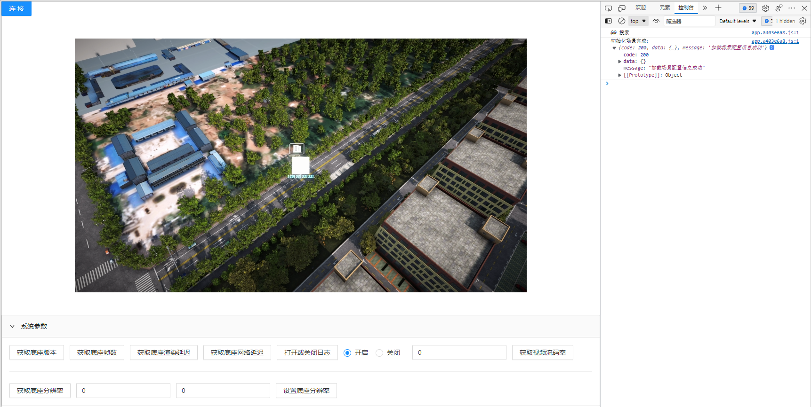

## 基础功能
### 场景

#### API名称：
初始化场景
#### 功能描述：

加载底座场景配置（包含生命体配置、分镜配置、资产配置）
#### 渲染示例：


#### 调用方法：
##### ES6 Modules
``` javascript
import { SceneConfig } from 'kd-api/lib';

SceneConfig.loadScene()
.then((res)=>{
    // 加载场景成功
    console.log(res)
})
.catch((err)=>{})

```

##### Script 标签
``` javascript
window.KdApi.SceneConfig.loadScene()
.then((res)=>{
    // 加载场景成功
    console.log(res)
})
.catch((err)=>{})

```


##### 回调数据参数描述：

| 属性    | 类型   | 说明                     |
| ------- | ------ | -------- |
| code    | Number | 200: 成功，500：失败  |
| message    | String | 成功或者失败描述  |
