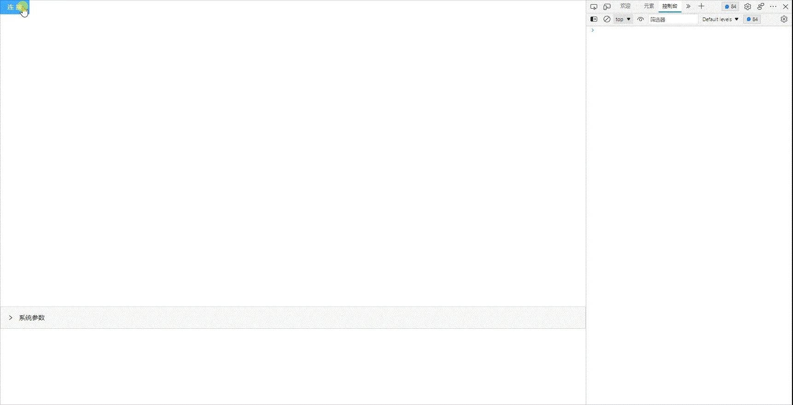

<!--
 * @Author: 关广强 ggq@jsszkd.com
 * @Date: 2022-04-26 10:41:18
 * @LastEditors: 关广强 ggq@jsszkd.com
 * @LastEditTime: 2022-06-01 15:07:37
 * @FilePath: \KD-API-DOCS\public\md\api\连接底座.md
 * @Description: 这是默认设置,请设置`customMade`, 打开koroFileHeader查看配置 进行设置: https://github.com/OBKoro1/koro1FileHeader/wiki/%E9%85%8D%E7%BD%AE
-->

## 基础功能
### 底座接入

#### API名称：
连接底座
#### 功能描述：

前端通过云渲染服务接入底座场景视频流

#### 渲染示例：


#### 调用方法：

##### ES6 Modules
``` javascript
import { SceneConfig } from 'kd-api/lib';

SceneConfig.initScene({
    type: number;
    renderId: string;
    url: string;
    resolution?: string;
    appId?: string;
    authCode?: string;
},{
    elementSize?: boolean;
    logLevel?: 'info' | 'warn' | 'error';
    scaleMode?: 'contain' | 'fill_clip' | 'fill_stretch'
})
.then((res)=>{
    // 初始化场景成功
    console.log(res)
})
.catch((err)=>{})

```

##### Script 标签
``` javascript
window.KdApi.SceneConfig.initScene({
    type: number;
    renderId: string;
    url: string;
    resolution?: string;
    appId?: string;
    authCode?: string;
},{
    elementSize?: boolean;
    logLevel?: 'info' | 'warn' | 'error';
    scaleMode?: 'contain' | 'fill_clip' | 'fill_stretch'
})
.then((res)=>{
    // 设置开启/关闭日志成功
    console.log(res)
})
.catch((err)=>{})
```

##### 参数描述：

| 属性      | 类型  | 是否必填 | 说明                                   |
| --------- | ------| ------ | ------ |
| type | String | Y | 底座引擎类型: 1=数字看点推流，2=浏览器内嵌，3=平行云    |
| renderId | String | Y | 承载video播放的dom元素ID。当type=3时元素为：`<div />`; 当type=1时元素为：`<video />`    |
| url | String | Y | 底座连接地址    |
| resolution | String | N | 分辨率。type=1时必传    |
| appId | String | N | 应用ID: type=3 必传    |
| authCode | String | N | initSDKAuthCode: type=3 必传    |
| elementSize | Boolean | N | 是否开启同步根元素组件的大小样式，默认开启    |
| logLevel | String | N | 日志级别：type=3时生效 `info` `warn` `error`。默认为`warn`
| scaleMode | String | N | 视频在容器中的缩放模式：type=3时生效。`contain`  `fill_clip`  `fill_stretch`
| codeRate | Number | N | 画质。越高越清晰 |


##### 回调数据参数描述：

| 属性    | 类型   | 说明                     |
| ------- | ------ | -------- |
| code    | Number | 200: 成功，500：失败  |
| message    | String | 成功或者失败描述  |
