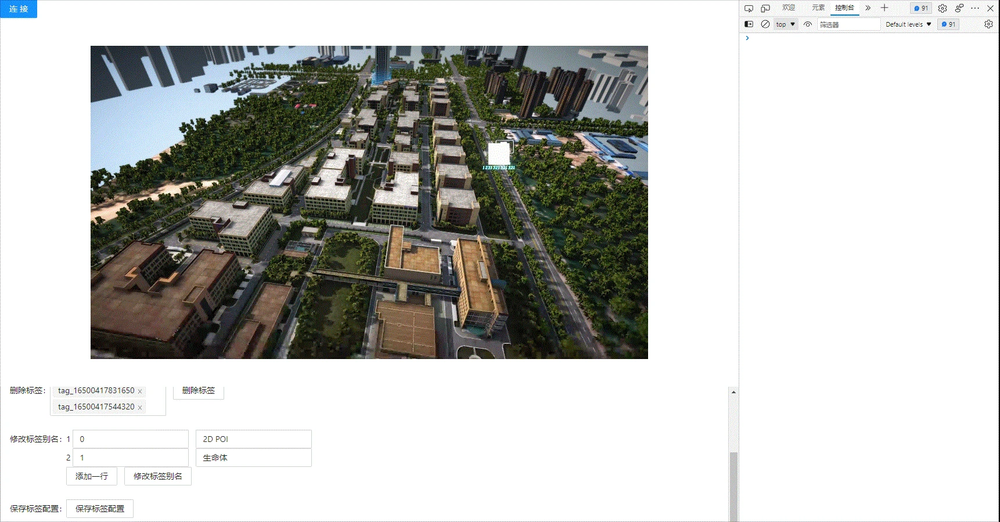

<!--
 * @Author: your name
 * @Date: 2022-03-30 15:08:15
 * @LastEditTime: 2022-04-06 17:09:55
 * @LastEditors: Please set LastEditors
 * @Description: 打开koroFileHeader查看配置 进行设置: https://github.com/OBKoro1/koro1FileHeader/wiki/%E9%85%8D%E7%BD%AE
 * @FilePath: \KD-API-DOCS\public\md\api\获取标签列表.md
-->
## 业务功能
### 标签

#### API名称：
保存标签配置
#### 功能描述：

保存底座中标签配置

#### 渲染示例：

#### 调用方法：

##### ES6 Modules
``` javascript
import {TagInfo} from 'kd-api/lib'

TagInfo.saveTagConfig()
.then((res)=>{
    // 修改别名成功
    console.log(res)
})
.catch((err)=>{})
```

##### Script 标签
``` javascript
window.KdApi.TagInfo.saveTagConfig()
.then((res)=>{
    // 修改别名成功
    console.log(res)
})
.catch((err)=>{})
```

##### 回调参数描述：
| 属性    | 类型   | 说明                     |
| ------- | ------ | ------------------------ |
| code    | Number | 200: 成功，500：失败  |
| message    | String | 成功或者失败描述  |


