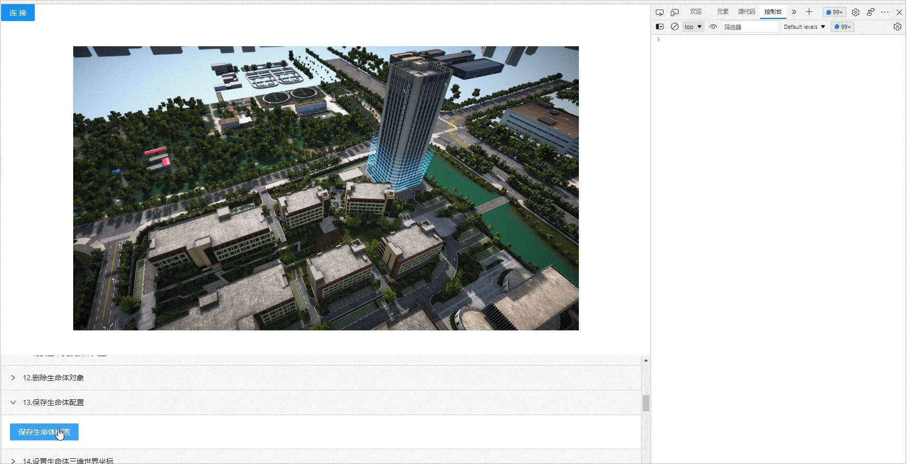

<!--
 * @Author: your name
 * @Date: 2022-3-30 14:43:49
 * @LastEditTime: 2022-03-29 09:28:25
 * @LastEditors: Please set LastEditors
 * @Description: 打开koroFileHeader查看配置 进行设置: https://github.com/OBKoro1/koro1FileHeader/wiki/%E9%85%8D%E7%BD%AE
 * @FilePath: /KD-API-DOCS/public/md/api/获取场景列表.md
-->
## 基础功能
### 生命体

#### API名称：
保存生命体配置
#### 功能描述：

保存场景中生命体配置（2D POI、3D POI、模型、特效）

#### 渲染示例：

#### 调用方法：

##### ES6 Modules
``` javascript
import { SceneModel } from 'kd-api/lib'

SceneModel.saveSceneModelConfig()
.then((res)=>{
    // 保存⽣命体配置成功
    console.log(res)
})
.catch((err)=>{})
```

##### Script 标签
``` javascript
window.KdApi.SceneModel.saveSceneModelConfig()
.then((res)=>{
    // 保存⽣命体配置成功
    console.log(res)
})
.catch((err)=>{})
```


##### 回调参数描述：
| 属性    | 类型   | 说明                     |
| ------- | ------ | ------------------------ |
| code    | Number | 0: 成功  |
| message    | String | 成功或者失败原因  |
