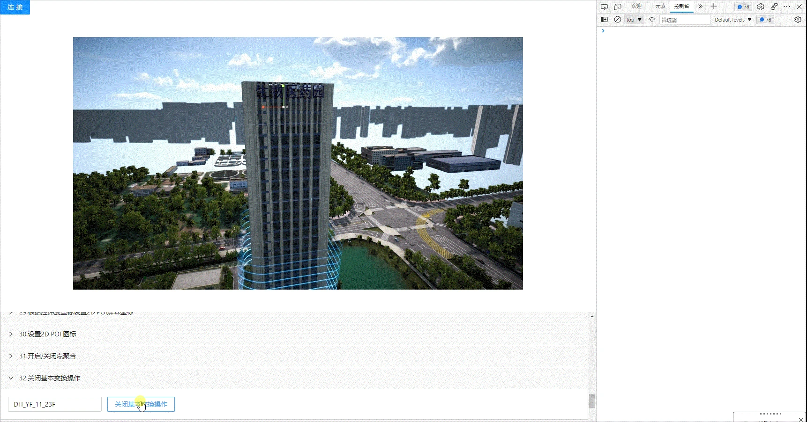

<!--
 * @Author: your name
 * @Date: 2022-3-30 14:40:32
 * @LastEditTime: 2022-04-14 11:24:22
 * @LastEditors: Please set LastEditors
 * @Description: 打开koroFileHeader查看配置 进行设置: https://github.com/OBKoro1/koro1FileHeader/wiki/%E9%85%8D%E7%BD%AE
 * @FilePath: /KD-API-DOCS/public/md/api/获取场景列表.md
-->
## 基础功能
### 生命体

#### API名称：
关闭基本变换操作
#### 功能描述：

关闭选中生命体对象基本变换操作

#### 渲染示例：

#### 调用方法：

##### ES6 Modules
``` javascript
import { SceneModel } from 'kd-api/lib'

SceneModel.closeOperateAction(jsondata)
.then((res)=>{
    // 关闭成功
    console.log(res)
})
.catch((err)=>{})
```

##### Script 标签
``` javascript
window.KdApi.SceneModel.closeOperateAction(jsondata)
.then((res)=>{
    // 关闭成功
    console.log(res)
})
.catch((err)=>{})
```


#### 数据格式：

```javascript
let jsondata = {
    uuid: ['xxxx_xxxx']
}
```
##### 参数描述：

| 属性    | 类型            | 是否必填 | 说明        |
| ------- |---------------|------|-----------|
| uuid    | Array[String] | Y    | 生命体ID |

##### 回调参数描述：
| 属性    | 类型   | 说明                     |
| ------- | ------ | ------------------------ |
| code    | Number | 0: 成功  |
| message    | String | 成功或者失败描述  |
