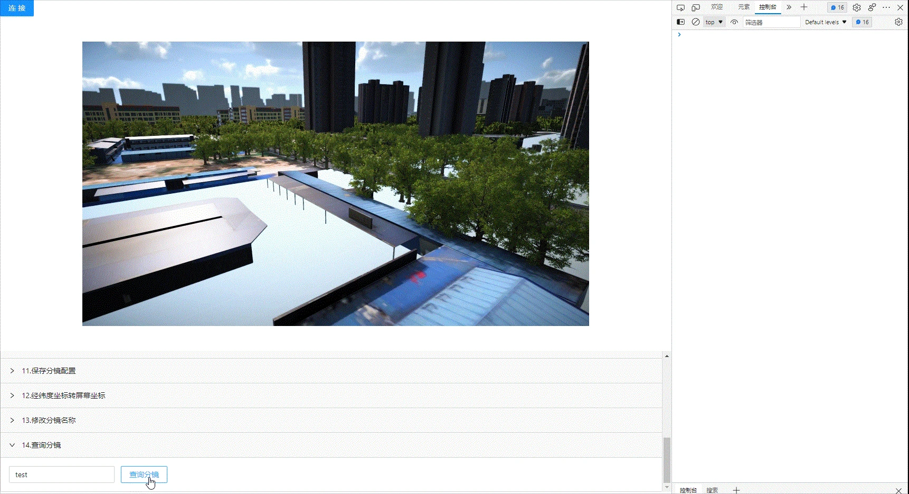

<!--
 * @Author: your name
 * @Date: 2022-03-30 15:08:15
 * @LastEditTime: 2022-04-19 15:23:02
 * @LastEditors: Please set LastEditors
 * @Description: 打开koroFileHeader查看配置 进行设置: https://github.com/OBKoro1/koro1FileHeader/wiki/%E9%85%8D%E7%BD%AE
 * @FilePath: \KD-API-DOCS\public\md\api\获取标签列表.md
-->
## 基础功能
### 摄像机

#### API名称：
查询分镜
#### 功能描述：

查询分镜列表中的指定分镜

#### 渲染示例：

#### 调用方法：

##### ES6 Modules
``` javascript
import { CameraConfig } from 'kd-api/lib'

CameraConfig.queryListByName(jsondata)
.then((res)=>{
    // 查询成功
    console.log(res)
})
.catch((err)=>{})
```

##### Script 标签
``` javascript
window.KdApi.CameraConfig.queryListByName(jsondata)
.then((res)=>{
    // 查询成功
    console.log(res)
})
.catch((err)=>{})
```

#### 数据格式：

```javascript
let jsondata = {
    name: 'xxxx'
}
```

##### 参数描述：

| 属性      | 类型  | 是否必填 | 说明     |
| --------- | ------| ------ | ------ |
| name | String | Y | 分镜名称   |

##### 回调参数描述：
| 属性    | 类型   | 说明                     |
| ------- | ------ | ------------------------ |
| code    | Number | 200: 成功，500：失败  |
| data    | List<Mirror> | 分镜列表 |
| message    | String | 成功或者失败描述  |

##### Mirror参数解析：
| 属性      | 类型   | 说明                                   |
| --------- | ------ | -------------------------------------- |
| cameraDistance | Number | 摄像机距离       |
| goalLocationX | String | 目标点位置，场景3D坐标-X轴        |
| goalLocationY | String | 目标点位置，场景3D坐标-Y轴       |
| goalLocationZ | String | 目标点位置，场景3D坐标-Z轴     |
| horizontalAngle | Number |  水平旋转角度     |
| id | Number |       |
| isDelete | Boolean |  是否删除     |
| isInit | Boolean |  是否初始分镜     |
| name | String |  分镜名称   |
| sceneUuid | String |  场景id  |
| uuid | String | 分镜id      |
| verticalAngle | Number | 垂直旋转角度    |

