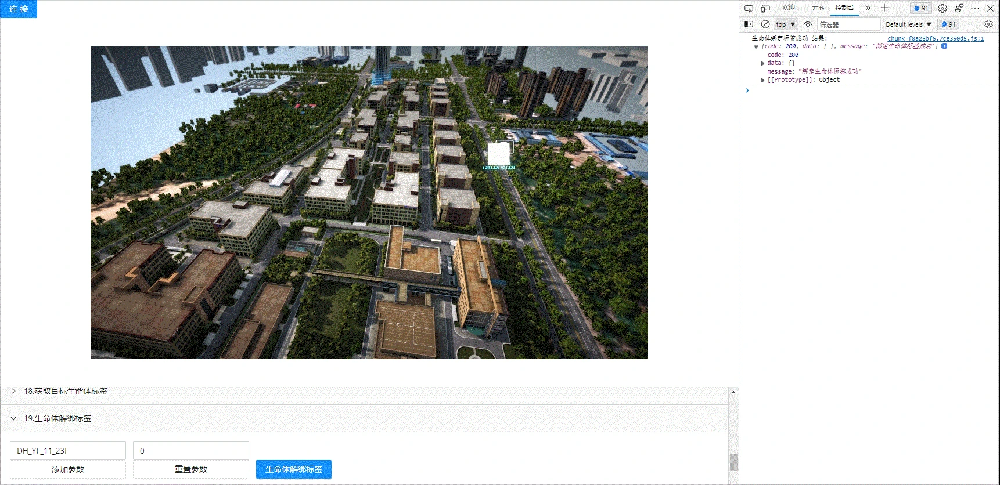

<!--
 * @Author: your name
 * @Date: 2022-3-30 14:36:42
 * @LastEditTime: 2022-03-29 09:28:25
 * @LastEditors: Please set LastEditors
 * @Description: 打开koroFileHeader查看配置 进行设置: https://github.com/OBKoro1/koro1FileHeader/wiki/%E9%85%8D%E7%BD%AE
 * @FilePath: /KD-API-DOCS/public/md/api/获取场景列表.md
-->
## 基础功能
### 生命体

#### API名称：
生命体对象解绑标签
#### 功能描述：

给目标生命体对象绑定标签

#### 渲染示例：

#### 调用方法：

##### ES6 Modules
``` javascript
import { SceneModel } from 'kd-api/lib'

SceneModel.removeTagListById(jsondata)
.then((res)=>{
    // 解绑成功
    console.log(res)
})
.catch((err)=>{})
```

##### Script 标签
``` javascript
window.KdApi.SceneModel.removeTagListById(jsondata)
.then((res)=>{
    // 解绑成功
    console.log(res)
})
.catch((err)=>{})
```


#### 数据格式：

```javascript
let jsondata = [{
    uuid: 'xxxx_xxxx',
    tagId:['tag_xxxx', 'tag_xxxx', 'tag_xxxx']
}]
```
##### 参数描述：

| 属性         | 类型            | 是否必填 | 说明     |
|------------|---------------|------|--------|
| uuid       | String | Y    | 生命体Id  |
| tagId       | Array[String] | Y    | 标签Id集合 |

##### 回调参数描述：
| 属性    | 类型   | 说明                     |
| ------- | ------ | ------------------------ |
| code    | Number | 0: 成功  |
| message    | String | 成功或者失败原因  |
