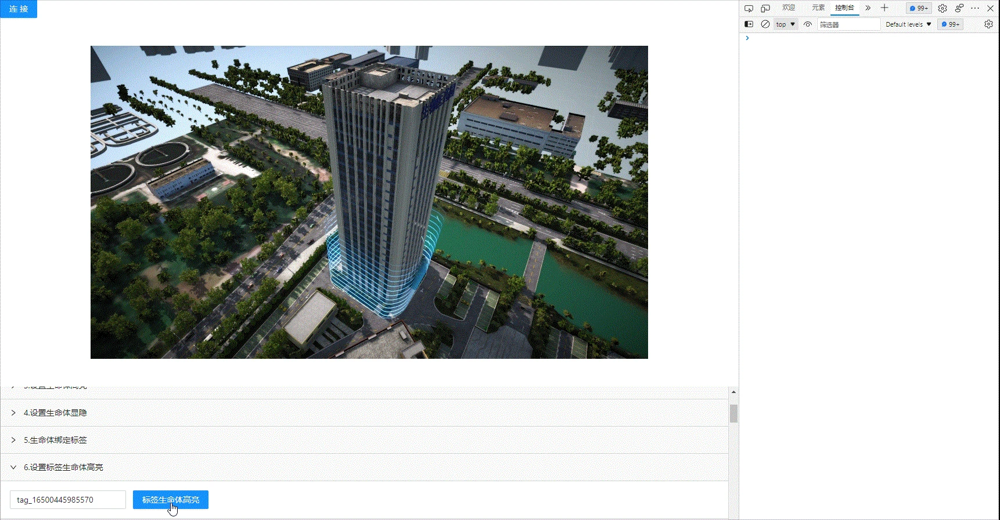

<!--
 * @Author: your name
 * @Date: 2022-3-30 14:43:49
 * @LastEditTime: 2022-03-29 09:28:25
 * @LastEditors: Please set LastEditors
 * @Description: 打开koroFileHeader查看配置 进行设置: https://github.com/OBKoro1/koro1FileHeader/wiki/%E9%85%8D%E7%BD%AE
 * @FilePath: /KD-API-DOCS/public/md/api/获取场景列表.md
-->
## 基础功能
### 生命体

#### API名称：
设置标签生命体高亮
#### 功能描述：

设置标签绑定的对应类型生命体高亮

#### 渲染示例：

#### 调用方法：

##### ES6 Modules
``` javascript
import { SceneModel } from 'kd-api/lib'

SceneModel.lightSceneModelByTag(jsondata)
.then((res)=>{
    // 根据标签设置⽣命体⾼亮/取消⾼亮成功
    console.log(res)
})
.catch((err)=>{})
```

##### Script 标签
``` javascript
window.KdApi.SceneModel.lightSceneModelByTag(jsondata)
.then((res)=>{
    // 根据标签设置⽣命体⾼亮/取消⾼亮成功
    console.log(res)
})
.catch((err)=>{})
```


#### 数据格式：

```javascript
let jsondata = {
    tag: ['xxxx_xxxx','xxxx_xxxx','xxxx_xxxx'],
    light: 1
}
```
##### 参数描述：

| 属性    | 类型            | 是否必填 | 说明          |
| ------- |---------------|------|-------------|
| tag    | Array[String] | Y    | 标签Id集合      |
| light    | Number        | Y    | 1：高亮，0：取消高亮 |

##### 回调参数描述：
| 属性    | 类型   | 说明                     |
| ------- | ------ | ------------------------ |
| code    | Number | 0: 成功  |
| data    | Array[String] | 设置高亮无效的生命体ID列表  |
| message    | String | 成功或者失败原因  |

目前只有模型可以高亮
